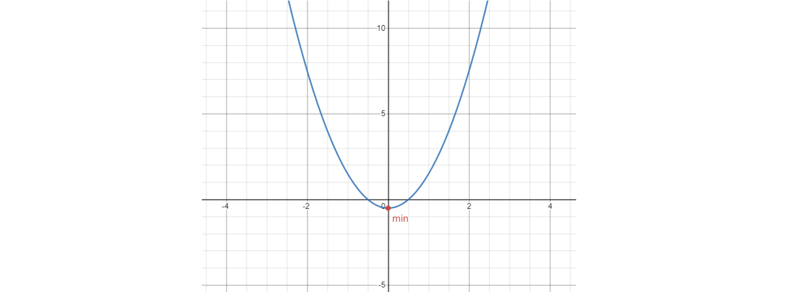
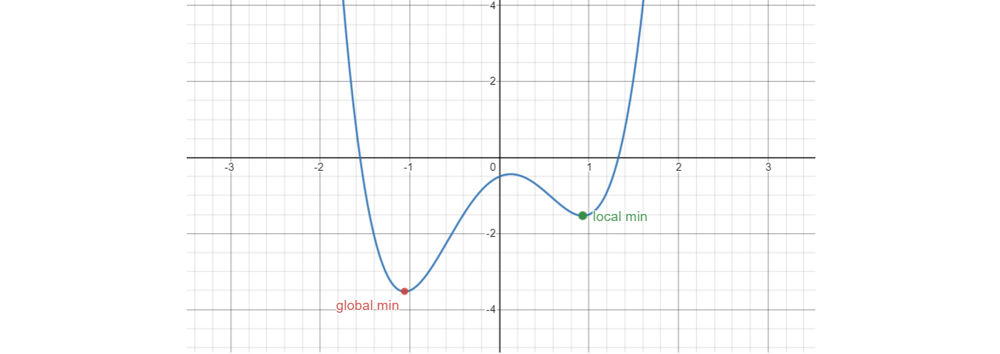

# Nonlinear optimization programming exercises
How to solve nonlinear optimization problems using different solvers and techniques based on Python.  

## About
**Author**  
Marcel Cases i Freixenet &lt;marcel.cases@estudiantat.upc.edu&gt;

**Course**  
Topics on Optimization and Machine Learning (TOML-MIRI)  
FIB - Universitat Politècnica de Catalunya. BarcelonaTech  
April 2021 

## Exercises
### Exercise 1
[Source code](https://github.com/marcelcases/nonlinear-optimization/blob/master/ex1.py)

Considering the optimization problem:  

minimize   
e<sup>x<sub>1</sub></sup>(4x<sub>1</sub><sup>2</sup> + 2x<sub>2</sub><sup>2</sup> + 4x<sub>1</sub>x<sub>2</sub> + 2x<sub>2</sub>+1)  

subject to  
x<sub>1</sub>x<sub>2</sub> - x<sub>1</sub> - x<sub>2</sub> &le; -1.5  
-x<sub>1</sub>x<sub>2</sub> &le; 10  

var  
x<sub>1</sub>, x<sub>2</sub>

Solutions obtained with `scipy.optimize.minimize` library, using SLSQP ([Sequential Least Squares Programming](https://en.wikipedia.org/wiki/Sequential_quadratic_programming)) method:

| Initial point x0 | Optimal p* | Coordinates (x1,x2) | Function evaluations (nfev) |
|------------------|------------|---------------------|-----------------------------|
| (0,0)            | 0.0235     | (-9.54,1.04)        | 54                          |
| (10,20)          | 3.0607     | (1.18,-1.73)        | 70                          |
| (-10,1)          | 0.0235     | (-9.54,1.04)        | 34                          |
| (-30,-30)        | 0.0235     | (-9.54,1.04)        | 41                          |

Solutions using the same parameters, plus a Jacobian input:  

| Initial point x0 | Optimal p*   | Coordinates (x1,x2) | Jacobian evaluations (njev) |
|------------------|--------------|---------------------|-----------------------------|
| (0,0)            | 0.0235       | (-9.54,1.04)        | 17                          |
| (10,20)          | 3.0607       | (1.18,-1.73)        | 21                          |
| (-10,1)          | 0.0235       | (-9.54,1.04)        | 11                          |
| (-30,-30)        | **141.0364** | **(-1.06,-6.45)**   | 21                          |

Analyze 141...

The plot of the objective function as well as the optimal points is as follows:


Is convex?
Does the graph help? no


### Exercise 2
[Source code](https://github.com/marcelcases/nonlinear-optimization/blob/master/ex2.py)

Considering the optimization problem:  

minimize   
x<sub>1</sub><sup>2</sup> + x<sub>2</sub><sup>2</sup>  

subject to  
-x<sub>1</sub> &le; -0.5  
-x<sub>1</sub> - x<sub>2</sub> + 1 &le; 0  
-x<sub>1</sub><sup>2</sup> - x<sub>2</sub><sup>2</sup> + 1 &le; 0  
-9x<sub>1</sub><sup>2</sup> - x<sub>2</sub><sup>2</sup> + 9 &le; 0  
-x<sub>1</sub><sup>2</sup> - x<sub>2</sub> &le; 0  
x<sub>1</sub> - x<sub>2</sub><sup>2</sup> &le; 0  

var  
x<sub>1</sub>, x<sub>2</sub>

Is convex?

Testing with different initial points and SLSQP, the following happened:
* (x1, x2) = (10, 10) is a **feasible initial point**, and returns the results:
    + Optimal p* = 2.0
    + Coordinates (x1, x2) = (1.0, 1.0)
* (x1, x2) = (0, 0) is a **non-feasible initial point**. The solver threw the message `Positive directional derivative for linesearch`, meaning that the optimizer got into a position where it did not manage to find a direction where the value of the objective function decreases.

After running the solver with the Jacobian input and the feasible initial point above, the obtained results were the same, with just 9 Jacobian evaluations `njev`, as compared to 73 function evaluations `nfev` without the Jacobian method.

The plot of the objective function is as follows:


### Exercise 3
[Source code](https://github.com/marcelcases/nonlinear-optimization/blob/master/ex3.py)

Considering the optimization problem:  

minimize   
x<sub>1</sub><sup>2</sup> + x<sub>2</sub><sup>2</sup>  

subject to  
x<sub>1</sub><sup>2</sup> + x<sub>1</sub>x<sub>2</sub> + x<sub>2</sub><sup>2</sup> &le; 3  
3x<sub>1</sub> + 2x<sub>2</sub>  &ge; 3  

var  
x<sub>1</sub>, x<sub>2</sub>

Is convex?
Check convergence

Two different solvers have been used to obtain the optimal:
* Scipy's `optimize.minimize` library, using SLSQP and the combinations:
    + bare solver
    + Jacobian as an input
    + Jacobian and Hessian as an input
* [CVXPY](https://www.cvxpy.org/)

Using (x<sub>1</sub>, x<sub>2</sub>) = (10, 10) as the initial guess, results are the following:

| Solver                          | Optimal p* | Coordinates (x1,x2) | Iterations   |
|---------------------------------|------------|---------------------|--------------|
| Scipy                           | 0.6923     | (0.6923, 0.4615)    | 12           |
| Scipy with Jacobian             | 0.6923     | (0.6923, 0.4615)    | 4            |
| Scipy with Jacobian and Hessian | 0.6923     | (0.6923, 0.4615)    | 4            |
| CVXPY                           | 0.6923     | (0.6923, 0.4615)    | not provided |

CVXPY also provides the dual values &lambda;<sub>1</sub> = 0 and &lambda;<sub>2</sub> = 0.4615.

### Exercise 4
[Source code](https://github.com/marcelcases/nonlinear-optimization/blob/master/ex4.py)

Considering the optimization problem:  

minimize   
x<sup>2</sup> + 1  

subject to  
(x-2)(x-4) &le; 0   

var  
x  

Using CVXPY as the solver, the following results are obtained:
````
solve 4.999999979918552
status: optimal
optimal value p* =  4.999999979918552
optimal var: x =  [2.]
optimal dual variables lambda =  [2.00003221]
````

Graphically, 


As shown in the plot, the minimum of the function within the feasible area is the point (x*, p*) = (2.0, 5.0).

The dual values obtained are &lambda; = 2 and d*=5.

### Exercise 5
[Source code](https://github.com/marcelcases/nonlinear-optimization/blob/master/ex5.py)

Considering the optimization problem:  

minimize   
x<sub>1</sub><sup>2</sup> + x<sub>2</sub><sup>2</sup>  

subject to  
 (x<sub>1</sub> - 1)<sup>2</sup> + (x<sub>2</sub> - 1)<sup>2</sup> &le; 1  
 (x<sub>1</sub> - 1)<sup>2</sup> + (x<sub>2</sub> + 1)<sup>2</sup> &le; 1  

var  
x<sub>1</sub>, x<sub>2</sub>

Using CVXPY as the solver, the following results are obtained:
````
solve 0.9999658242523712
status: optimal
optimal value p* =  0.9999658242523712
optimal var: x1 =  0.9999802295393706  x2 =  1.9912424211981957e-14
optimal dual variables lambda1 =  28013.52446782075
optimal dual variables lambda2 =  28013.52446781738
````

### Exercise 6
[Source code](https://github.com/marcelcases/nonlinear-optimization/blob/master/ex6.py)

**Gradient Descent Methods for an unconstrained optimization problem**

The Gradient Descent Algorithm assumes that

x<sup>(k+1)</sup> = x<sup>(k)</sup> + t&Delta;x = x<sup>(k)</sup> - t&nabla;f(x<sup>(k)</sup>)

For this problem, two functions are minimized:
* f(x) = 2x<sup>2</sup> - 0.5, with initial point x<sub>0</sub> = 3
* f(x) = 2x<sup>4</sup> - 4x<sup>2</sup> + x - 0.5, with initial points x<sub>0</sub> = -2, x<sub>0</sub> = -0.5, x<sub>0</sub> = 0.5, x<sub>0</sub> = 2

Two Gradient Descent methods are used:
* Backtracking Line Search
* Newton’s Method

This problem has been optimized by using **custom developed solvers** with basic Python libraries.

**Backtracking Line Search algorithm**

````python
def backtrack(dfx, x0, step):
    incumbent = x0 # result
    iters = 0
    acc = 1e-4
    while (acc >= 1e-4):
        newincumbent = incumbent - step*dfx(incumbent)
        acc = np.absolute(newincumbent - incumbent)
        incumbent = newincumbent
        iters += 1
    return incumbent, iters, acc, step
````

The inputs of the function are the first-degree derivative of the objective function `dfx`, an initial point `x0`, and a `step` that sets the resolution of the solver. The solver iterates indefinitely until the accuracy value `acc` is reached, which means that a local/global minima has been found. After this, the solution (x*) is returned (`incumbent`), as well as the number of iterations, the accuracy and the step value.

**Newton’s Method algorithm**

Newton's Method uses a second-order Taylor series expansion of the function about the current design point, i.e. a quadratic model. Scipy's library `optimize` uses this method for computing the minimum value of the function.

**Results and performance**

For f(x) = 2x<sup>2</sup> - 0.5, with initial point x<sub>0</sub> = 3, the results obtained with both methods are the following:

| Solver                             | Optimal p* | Optimal x* | Iterations |
|------------------------------------|------------|------------|------------|
| Backtracking Line Search           | -0.498     | 0.0248     | 1196       |
| Newton's with Jacobian and Hessian | -0.5       | 0.0        | 5          |

For f(x) = 2x<sup>4</sup> - 4x<sup>2</sup> + x - 0.5, the results obtained with both methods are the following:

| Initial point x0 | Solver                             | Optimal p* | Optimal x* | Iterations |
|------------------|------------------------------------|------------|------------|------------|
| -2               | Backtracking Line Search           | -3.529     | -1.062     | 228        |
| -2               | Newton's with Jacobian and Hessian | -3.529     | -1.057     | 7          |
| -0.5             | Backtracking Line Search           | -3.529     | -1.052     | 304        |
| -0.5             | Newton's with Jacobian and Hessian | -3.529     | -1.057     | 8          |
| 0.5              | Backtracking Line Search           | -1.533     | 0.922      | 399        |
| 0.5              | Newton's with Jacobian and Hessian | -1.533     | 0.930      | 8          |
| 2                | Backtracking Line Search           | -1.533     | 0.937      | 297        |
| 2                | Newton's with Jacobian and Hessian | -1.533     | 0.930      | 7          |

For the BLS, the `step` parameter has been set to 1e-3. Making it lower will improve the performance of the algorithm by reducing the computing time, but the results would not be as accurate.

**Plots**

For f(x) = 2x<sup>2</sup> - 0.5, any initial point will converge to the global minimum of the function, which is (x*, p*) = (0.0, -0.5).



For f(x) = 2x<sup>4</sup> - 4x<sup>2</sup> + x - 0.5, depending on the initial point, the solution will fall into either:
* the local minima, if x<sub>0</sub> &gt; 0.15
* the global minima, otherwise

The local minima is (x*, p*) = (0.92, -1.53), and the global minima is (x*, p*) = (-1.05, -3.52).



### Exercise 7
[Source code](https://github.com/marcelcases/nonlinear-optimization/blob/master/ex7.py)

**Network Utility problem**

A networking problem where sources traverse links from routers in order to transmit data. Source 1 traverses link 1 and 2, source 2 traverses link 2 and source 3 traverses link 1 and 5. The goal is to maximize the transmission rate _x<sub>s</sub>_.

The model of the problem is the following:

maximize   
log x<sub>1</sub> + log x<sub>2</sub> + log x<sub>3</sub>  

subject to  
x<sub>1</sub> + x<sub>3</sub> &le; 1  
x<sub>1</sub> + x<sub>2</sub> &le; 2  
x<sub>3</sub> &le; 1  
x<sub>1</sub>, x<sub>2</sub>,  x<sub>3</sub> &ge; 0  

var  
x<sub>1</sub>, x<sub>2</sub>,  x<sub>3</sub>  

Using CVXPY as the solver, the following results are obtained:
````
solve -0.9547712365062518
status: optimal
optimal value p* = -0.9547712365062518
optimal var: x1 = 0.4226489442893967  x2 = 1.577351049782123  x3 = 0.5773510541368012
optimal dual variables lambda1 = 1.7320483134403175   
                        lambda2 = 0.6339745314617544   
                        lambda3 = 6.437850296384749e-09   
                        lambda4 = 6.544679319172325e-09   
                        lambda5 = 1.7755538040590713e-09
````

### Exercise 8
[Source code](https://github.com/marcelcases/nonlinear-optimization/blob/master/ex8.py)

**Resource Allocation problem**

A resource allocation problem for a wireless network where traffic has to be assigned to nodes and links. Collisions have to be avoided (e.g. time R<sub>12</sub> can not transmit simultaneously with R<sub>23</sub>), and links are bidirectional (R<sub>12</sub> + R<sub>23</sub> + R<sub>32</sub> &le; 1).

The model of the problem is the following:

maximize   
log x<sub>1</sub> + log x<sub>2</sub> + log x<sub>3</sub>  

subject to  
x<sub>1</sub> + x<sub>2</sub> &le; R<sub>12</sub>  
x<sub>1</sub> &le; R<sub>23</sub>  
x<sub>3</sub> &le; R<sub>32</sub>  
R<sub>12</sub> + R<sub>23</sub> + R<sub>32</sub> &le; 1  
x<sub>i</sub>, R<sub>i</sub> &ge; 0

var  
x<sub>1</sub>, x<sub>2</sub>,  x<sub>3</sub>, R<sub>12</sub>, R<sub>23</sub>, R<sub>32</sub>  

Using CVXPY as the solver, the following results are obtained:
````
solve -3.9889840093737394
status: optimal
optimal value p* = -3.9889840093737394
optimal var: x1 = [0.16666665]  x2 = [0.33333335]  x3 = [0.33333335]  
                        r12 = [0.5]  r23 = [0.16666665]  r32 = [0.33333335]
optimal dual variables lambda1 = [2.99999975]   lambda2 = [2.99999975]   
                        lambda3 = [2.99999975]   u1 = [2.99999975]
````


## References
Class slides  
CVXPY [https://www.cvxpy.org/](https://www.cvxpy.org/)  
Convex optimization [https://en.wikipedia.org/wiki/Convex_optimization](https://en.wikipedia.org/wiki/Convex_optimization)  
Sequential Least Squares Programming [https://en.wikipedia.org/wiki/Sequential_quadratic_programming](https://en.wikipedia.org/wiki/Sequential_quadratic_programming)  
Backtracking Line Search [https://sites.math.washington.edu/~burke/crs/408/lectures/L7-line-search.pdf](https://sites.math.washington.edu/~burke/crs/408/lectures/L7-line-search.pdf)  
