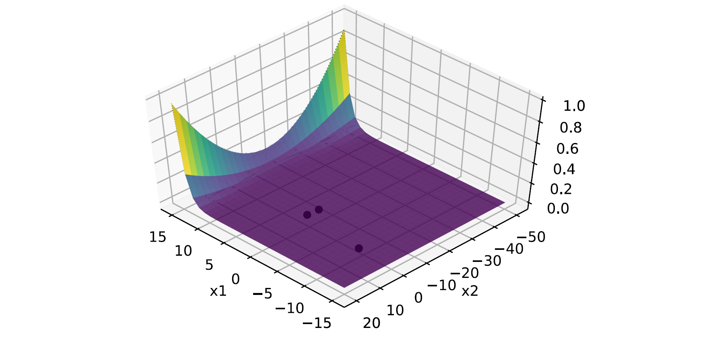

# Non-linear optimization programming exercises
How to solve non-linear optimization problems using different solvers and techniques based on Python.  

## About
**Author**  
Marcel Cases i Freixenet &lt;marcel.cases@estudiantat.upc.edu&gt;

**Course**  
Topics on Optimization and Machine Learning (TOML-MIRI)  
FIB - Universitat Politècnica de Catalunya. BarcelonaTech  
April 2021 

## Exercises
### Exercise 1

Considering the optimization problem:  

minimize   
e<sup>x<sub>1</sub></sup>(4x<sub>1</sub><sup>2</sup> + 2x<sub>2</sub><sup>2</sup> + 4x<sub>1</sub>x<sub>2</sub> + 2x<sub>2</sub>+1)  

subject to  
x<sub>1</sub>x<sub>2</sub> - x<sub>1</sub> - x<sub>2</sub> &le; -1.5  
-x<sub>1</sub>x<sub>2</sub> &le; 10  

var  
x<sub>1</sub>, x<sub>2</sub>

Solutions obtained with `scipy.optimize.minimize` library, using SLSQP (Sequential Least Squares Programming) method:

| Initial point x0 | Optimal p* | Coordinates (x1,x2) | Function evaluations (nfev) |
|------------------|------------|---------------------|-----------------------------|
| (0,0)            | 0.0235     | (-9.54,1.04)        | 54                          |
| (10,20)          | 3.0607     | (1.18,-1.73)        | 70                          |
| (-10,1)          | 0.0235     | (-9.54,1.04)        | 34                          |
| (-30,-30)        | 0.0235     | (-9.54,1.04)        | 41                          |

Solutions using the same parameters, plus a Jacobian input:  

| Initial point x0 | Optimal p*   | Coordinates (x1,x2) | Jacobian evaluations (njev) |
|------------------|--------------|---------------------|-----------------------------|
| (0,0)            | 0.0235       | (-9.54,1.04)        | 17                          |
| (10,20)          | 3.0607       | (1.18,-1.73)        | 21                          |
| (-10,1)          | 0.0235       | (-9.54,1.04)        | 11                          |
| (-30,-30)        | **141.0364** | **(-1.06,-6.45)**   | 21                          |

Analyze 141...

The plot of the objective function as well as the optimal points is as follows:



Is convex?
Does the graph help? no


### Exercise 2

Considering the optimization problem:  

minimize   
x<sub>1</sub><sup>2</sup> + x<sub>2</sub><sup>2</sup>  

subject to  
-x<sub>1</sub> &le; -0.5  
-x<sub>1</sub> - x<sub>2</sub> + 1 &le; 0  
-x<sub>1</sub><sup>2</sup> - x<sub>2</sub><sup>2</sup> + 1 &le; 0  
-9x<sub>1</sub><sup>2</sup> - x<sub>2</sub><sup>2</sup> + 9 &le; 0  
-x<sub>1</sub><sup>2</sup> - x<sub>2</sub> &le; 0  
x<sub>1</sub> - x<sub>2</sub><sup>2</sup> &le; 0  

var  
x<sub>1</sub>, x<sub>2</sub>

Is convex?

Testing with different initial points and SLSQP, the following happened:
* **(x1, x2) = (10, 10)** is a **feasible initial point**, and returns the results:
    + Optimal **p* = 2.0**
    + Coordinates **(x1, x2) = (1.0, 1.0)**
* **(x1, x2) = (0, 0)** is a **non-feasible initial point**. The solver threw the message `Positive directional derivative for linesearch`, meaning that the optimizer got into a position where it did not manage to find a direction where the value of the objective function decreases.

After running the solver with the Jacobian input and the feasible initial point above, the obtained results were the same, with just 9 Jacobian evaluations `njev`, as compared to 73 function evaluations `nfev` without the Jacobian method.

The plot of the objective function is as follows:


### Exercise 3

Considering the optimization problem:  

minimize   
x<sub>1</sub><sup>2</sup> + x<sub>2</sub><sup>2</sup>  

subject to  
x<sub>1</sub><sup>2</sup> + x<sub>1</sub>x<sub>2</sub> + x<sub>2</sub><sup>2</sup> &le; 3  
3x<sub>1</sub> + 2x<sub>2</sub>  &ge; 3  

var  
x<sub>1</sub>, x<sub>2</sub>

Is convex?
Check convergence

Two different solvers have been used to obtain the optimal:
* Scipy's `optimize.minimize` library, using SLSQP and the combinations:
    + bare solver
    + Jacobian as an input
    + Jacobian and Hessian as an input
* [CVXPY](https://www.cvxpy.org/)

Using (x<sub>1</sub>, x<sub>2</sub>) = (10, 10) as the initial guess, results are the following:

| Solver                          | Optimal p* | Coordinates (x1,x2) | Iterations   |
|---------------------------------|------------|---------------------|--------------|
| Scipy                           | 0.6923     | (0.6923, 0.4615)    | 12           |
| Scipy with Jacobian             | 0.6923     | (0.6923, 0.4615)    | 4            |
| Scipy with Jacobian and Hessian | 0.6923     | (0.6923, 0.4615)    | 4            |
| CVXPY                           | 0.6923     | (0.6923, 0.4615)    | not provided |

CVXPY also provides the dual values &lambda;<sub>1</sub> = 0 and &lambda;<sub>2</sub> = 0.4615.

### Exercise 4

Considering the optimization problem:  

minimize   
x<sup>2</sup> + 1  

subject to  
(x-2)(x-4) &le; 0   

var  
x  

Using CVXPY as the solver, the following results are obtained:
````
solve 4.999999979918552
status: optimal
optimal value p* =  4.999999979918552
optimal var: x =  [2.]
optimal dual variables lambda =  [2.00003221]
````

Graphically, 


As shown in the plot, the minimum of the function within the feasible area is (x*, p*) = (2.0, 5.0).

The dual values obtained are &lambda; = 2 and d*=5.

### Exercise 5
### Exercise 6
### Exercise 7
### Exercise 8
